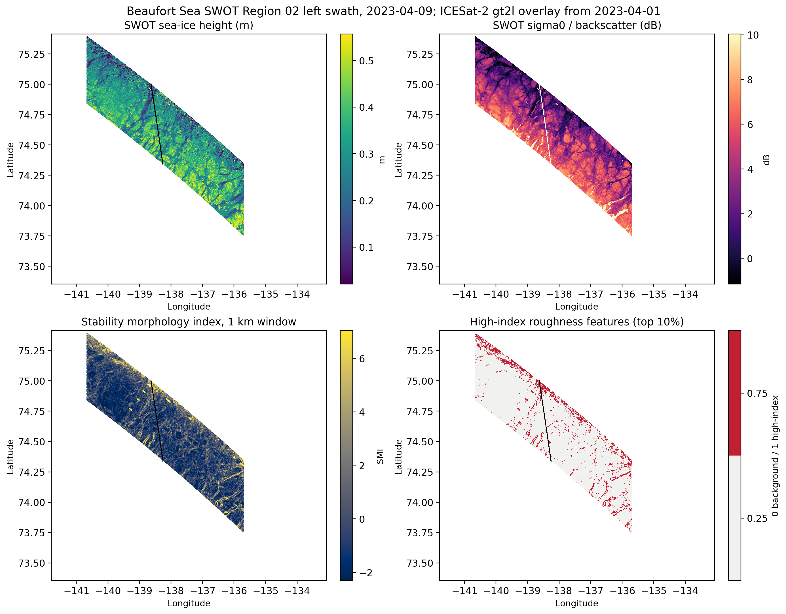
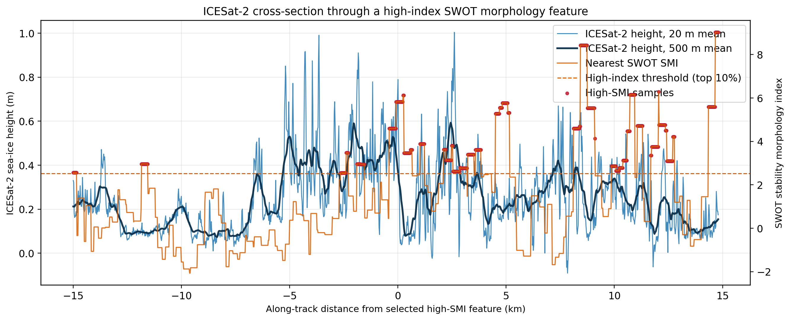
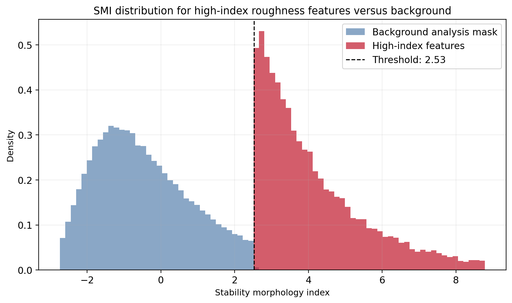
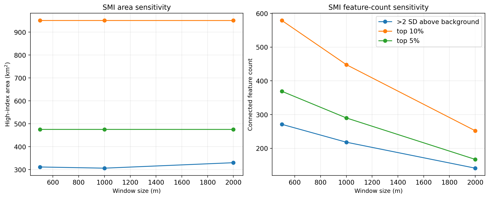
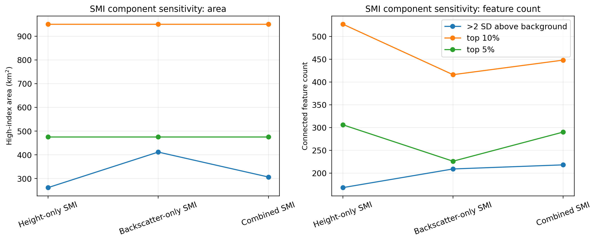
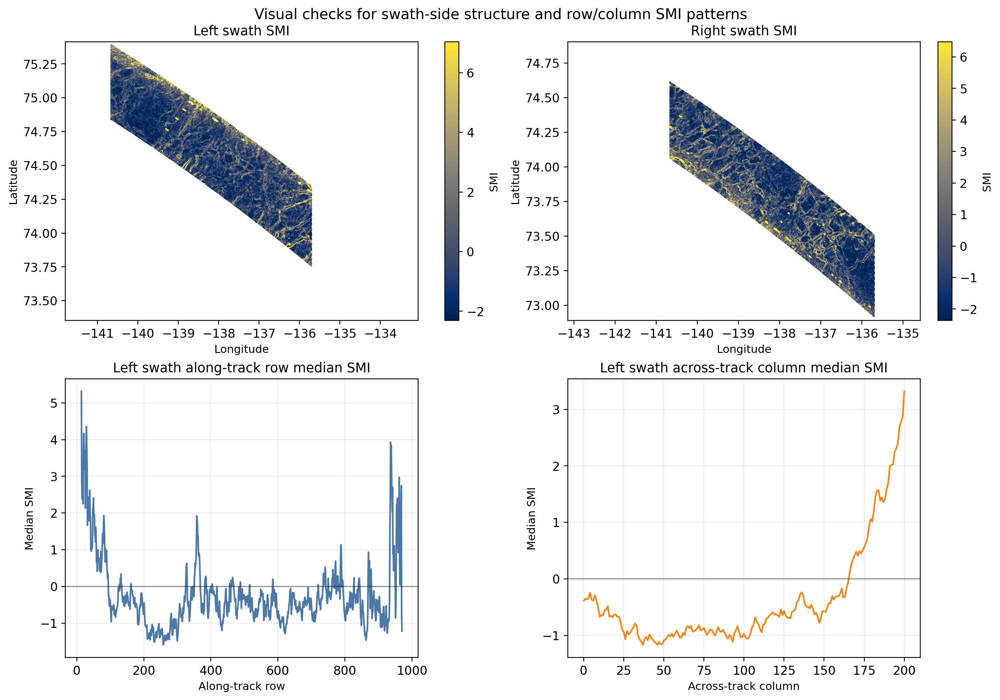
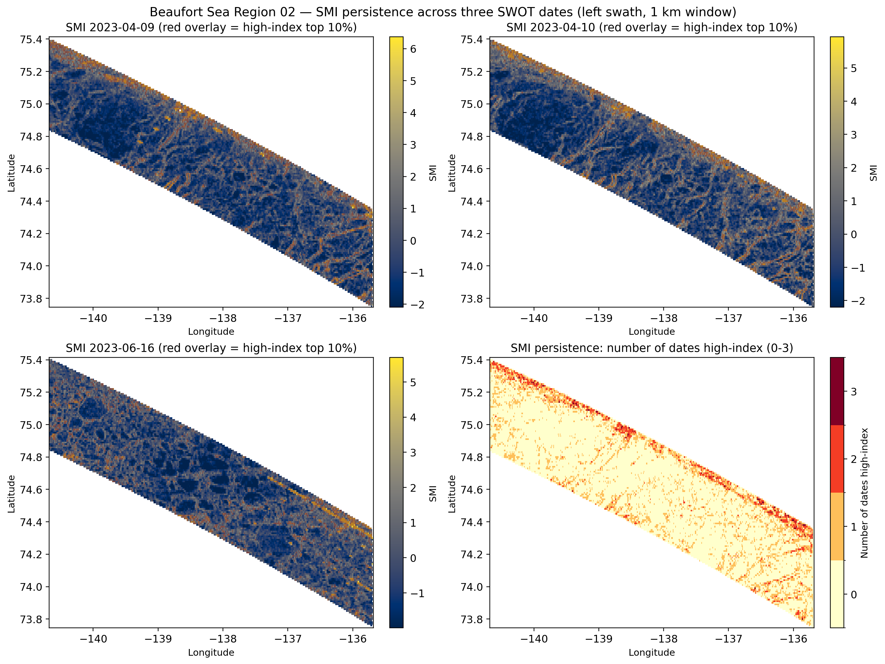
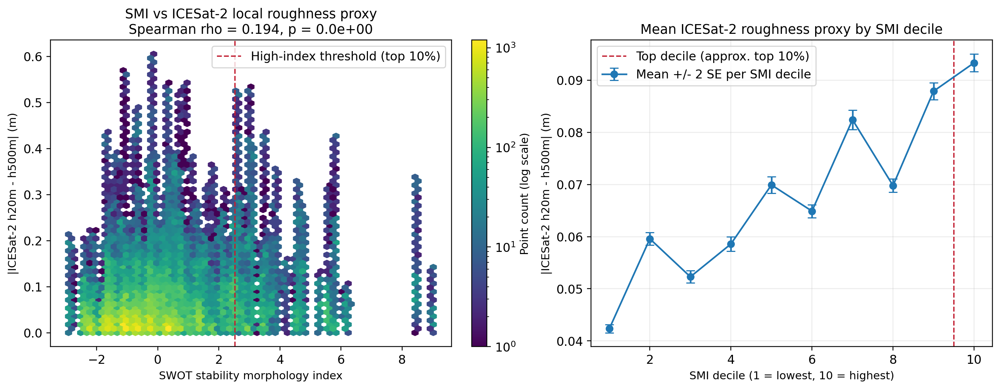
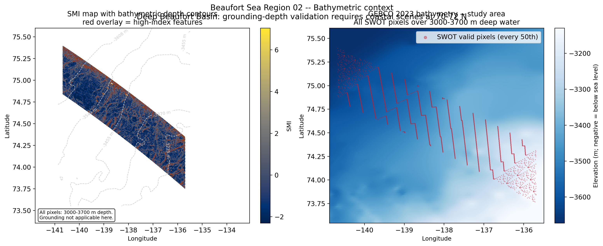
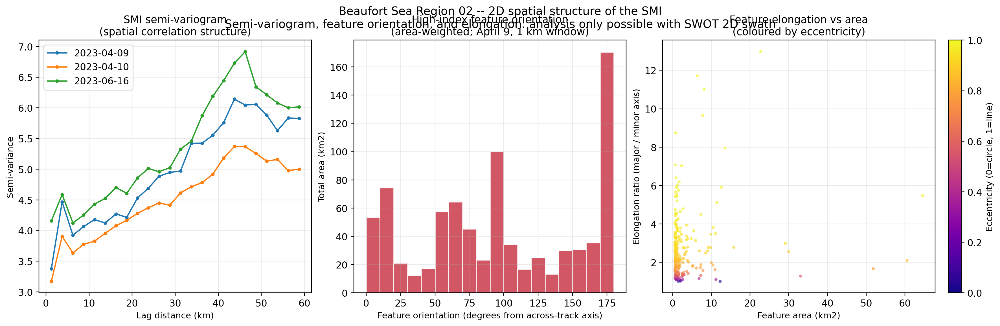

# 2D Spatial Structure of Sea-Ice Morphology from SWOT KaRIn

## Core question

Every published SWOT sea-ice paper treats the swath as a wide along-track altimeter.
ICESat-2, CryoSat-2, and all prior instruments are inherently one-dimensional.
SWOT is the first spaceborne instrument with continuous 2D Ka-band height and backscatter at ~250 m resolution across a 100 km swath.

**What is the 2D spatial structure -- correlation length, anisotropy, feature orientation -- of sea-ice morphology as measured by SWOT KaRIn? Does it change between seasons?**

This cannot be answered with along-track data alone.

## About

Kacimi et al. (2025, GRL) demonstrated lead/floe discrimination and freeboard. A May 2025 ESS preprint used this same dataset to show ridge detection, 3D freeboard, and daily velocity. Neither paper characterises the 2D spatial structure of the morphology field.

The specific additions here:
1. A stability morphology index (SMI) combining height roughness, gradient, and backscatter texture.
2. Algorithmic uncertainty quantification (window, threshold, component sensitivity).
3. Multi-date Jaccard persistence analysis across three scenes (one-day and two-month separation).
4. Bathymetric context confirming the scene is over deep Beaufort Basin (3000-3700 m) -- grounded ridge anchoring is not applicable; future grounding work needs coastal scenes.
5. **Semi-variogram, spatial correlation length (~40 km), feature orientation, and elongation metrics** -- the first characterisation of 2D spatial structure from SWOT KaRIn sea-ice data.

## Dataset

This prototype uses the published Beaufort Sea SWOT-ICESat-2 dataset from Zenodo:

https://zenodo.org/records/15238132

Primary prototype case:

- SWOT: `UMD_SWOT_024_BeaufortSea_Study_Region_02_20230409.nc`
- SWOT swath: `left`
- ICESat-2: `UMD_IC2_0174_BeaufortSea_Study_Region_02_20230401.nc`
- ICESat-2 beam: `gt2l`

The selected Region 02 SWOT and ICESat-2 files overlap spatially, but the ICESat-2 pass is 8 days earlier than the SWOT scene. The notebook treats that comparison as partial spatial support, not definitive validation.

## Method

The notebook:

1. Downloads and inventories the Zenodo NetCDF files.
2. Opens the selected SWOT swath and ICESat-2 beam without assuming variable names in advance.
3. Builds a provisional ice-like analysis mask from finite height/backscatter and broad height bounds.
4. Infers SWOT grid spacing from neighboring latitude/longitude cells.
5. Computes local height roughness, height gradient magnitude, and local sigma0 texture for 500 m, 1 km, and 2 km windows.
6. Combines standardized metrics into a stability morphology index:

   `SMI = z(local height std) + z(height gradient magnitude) + z(local sigma0 std)`

7. Tests height-only, backscatter-only, and combined SMI variants.
8. Thresholds the SMI into high-index roughness features, treated as candidate stability-relevant morphology only.
9. Collocates the SMI to ICESat-2 points with nearest-neighbor sampling in a local projected coordinate system.
10. Runs algorithmic uncertainty checks for window size, threshold choice, component choice, swath-side differences, and row/column structure.

## Figures

### Main result: SWOT height, sigma0, SMI, and high-index roughness features


### ICESat-2 height cross-section through a high-SMI feature


### SMI distribution: high-index pixels vs background ice-like pixels


### Algorithmic uncertainty — window size and threshold sensitivity


### Algorithmic uncertainty — component sensitivity (height-only, backscatter-only, combined)


### Artifact checks — left/right swath behavior and row/column SMI patterns


### Multi-date SMI persistence across three Region 02 scenes (April 9, April 10, June 16)


### ICESat-2 roughness correlation: SMI vs |h20m - h500m| (Spearman rho = 0.194, p < 0.001)


### Bathymetric context: scene is over deep Beaufort Basin (3000-3700 m)


### 2D spatial structure: semi-variogram (~40 km correlation length), feature orientation and elongation


## Outputs

Generated figures are saved in `figures/`:

- `four_panel_smi_region02_left_20230409.png`: SWOT height, sigma0, SMI, and high-index roughness features with ICESat-2 overlay.
- `icesat2_smi_cross_section_region02_left_gt2l.png`: ICESat-2 height cross-section through a high-SMI feature with nearest SWOT SMI.
- `smi_histogram_region02_left_20230409.png`: SMI distributions for high-index pixels versus background ice-like pixels.
- `smi_window_threshold_sensitivity_region02_left_20230409.png`: high-index area and feature count versus window size and threshold.
- `smi_component_sensitivity_region02_left_20230409.png`: high-index area and feature count for height-only, backscatter-only, and combined SMI.
- `smi_artifact_checks_region02_20230409.png`: visual checks for left/right swath behavior and row/column SMI patterns.
- `smi_persistence_region02_left.png`: SMI maps for all three Region 02 dates side-by-side plus a persistence count map (0–3 dates high-index), with pairwise Jaccard similarity table.

Current 1 km-window prototype result:

- Valid SWOT analysis pixels: 159,046.
- Top 10 percent high-index threshold: SMI >= 2.53.
- High-index pixels: 15,886, about 951 km2.
- Connected high-index features after a 4-pixel minimum: 448.
- ICESat-2 matched points: 106,422.
- Top 5 percent sampled SMI points have higher mean ICESat-2 20 m versus 500 m height difference than background sampled points, consistent with enhanced along-track morphology but not proof of grounding, anchoring, thickness, or stability.

## Interpretation

High-index areas are candidate morphology features only. They are not confirmed grounded ridges, anchor points, thickness anomalies, or stable landfast-ice zones.

The method is useful if it produces coherent, robust, interpretable morphology features that can be carried forward into future validation against breakout or persistence data.

## Limitations

- No snow depth, density, radar penetration, local sea-surface reconstruction, or uncertainty propagation is included.
- No thickness product is generated.
- No external landfast-ice mask is used.
- The primary ICESat-2 comparison is spatially overlapping but temporally offset by 8 days.
- SWOT artifacts remain plausible, including swath-side differences, along-track/across-track structure, temporal height errors, calibration issues, and outlier height cells.
- The provisional mask is not a sea-ice or landfast-ice classifier.

## Future Validation Layers

1. Breakout prediction layer: compare SWOT roughness/ridge/anchor metrics before breakup against observed breakup locations or dates.
2. SAR persistence layer: use Sentinel-1 to classify landfast versus mobile ice before and after the SWOT scene, then test whether SWOT morphology predicts which zones remain attached.
3. Bathymetric grounding layer: combine SWOT roughness features with bathymetry to identify candidate grounded ridges or shallow-water anchoring zones, then test whether high-roughness features occur at plausible grounding depths.
4. Model-parameterization layer: convert SWOT-derived roughness, ridge density, or morphology-index statistics into parameters relevant to coastal drag, internal ice strength, or landfast-ice anchoring in models.
5. Algorithmic uncertainty layer: quantify how stable the morphology index is under swath-side differences, window size, threshold choice, score-component choice, and known SWOT sea-ice artifacts.

The current notebook prioritizes the algorithmic uncertainty layer because it is doable immediately with the existing dataset.

## Reproducibility

Run the notebook from this folder:

```bash
jupyter nbconvert --to notebook --execute --inplace swot_landfast_morphology_probe.ipynb --ExecutePreprocessor.timeout=900
```

The notebook caches NetCDF files in `data/raw/` and regenerates PNGs in `figures/`.

Main Python dependencies: `xarray`, `numpy`, `pandas`, `scipy`, `matplotlib`, `pyproj`, `netCDF4`, `scikit-image`, and `requests`.
